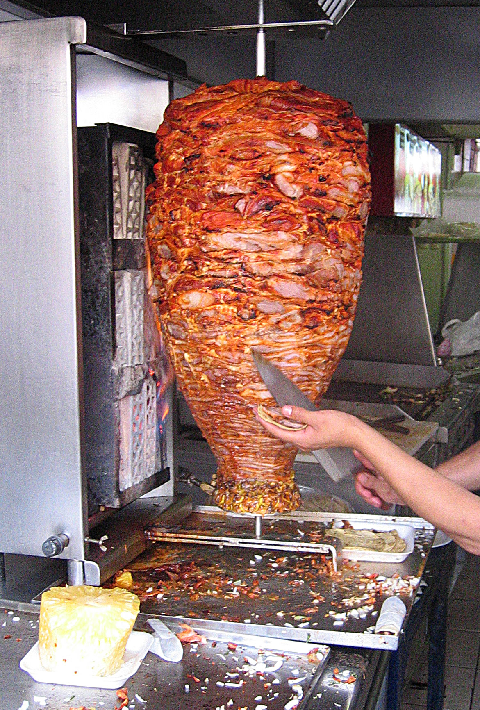

# EF-Informatik

## Essen:

**Lieblingsgetränk**: Sangría


**Lieblingsessen**: Tacos al pastor



## Aktivitäten:

**Hobbies**:  
 - _Klavierspielen_:  
Ich spiele seit etwa 7 Jahren Klavier.

- _Zeichnen_:  
Ich zeichne nur gerne mit Bleistift. 

- _Lesen_:  
Ich lese gerne Thrillers.

**Filme**:
- Herr der Ringe
- The Interpretor
- Inception  

Ich schaue gerne alte Filme.

## Codeprojekte:

Ein Decision-Tree Modell zu programmieren. 

```py
print('Hello World')
print('Es funktioniert')
```